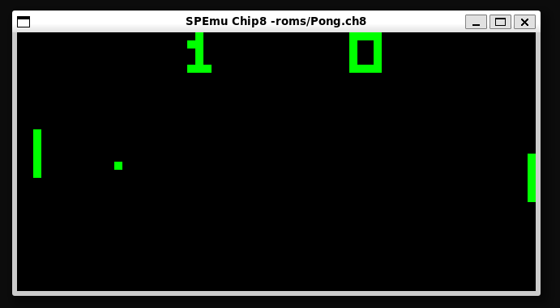
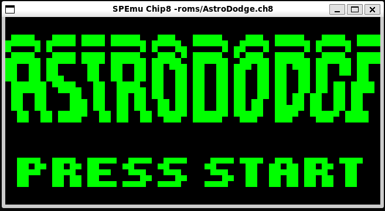

# CHIP-8 Emulator in C++/SDL2

Welcome to the CHIP-8 emulator! This project is a simple yet powerful emulator for the CHIP-8 system, written in C++ with SDL2. It emulates the CHIP-8 architecture, which is known for being the platform for early video games like *Pong*.

## Example Screenshots





## Features

- Emulates the CHIP-8 system
- SDL2 graphics for rendering
- Supports loading and running CHIP-8 ROMs
- Debugging mode for tracing execution

## Requirements

To build and run the CHIP-8 emulator, you need:

- C++17 or later
- `g++` compiler
- SDL2 library (for graphics and input handling)

### SDL2 Installation (Linux)

To install SDL2 on Linux, use the following commands:

```bash
sudo apt-get update
sudo apt-get install libsdl2-dev
```

## Building and Running the Emulator

### Building the Project

Once you've cloned the repository, follow these steps to build the emulator:

1. **Navigate to the project directory**:

    ```bash
    cd chip8_emulator
    ```

2. **Build the project**:

    Run the following command to compile the source files and generate the executable `chip8_emu`:

    ```bash
    make
    ```

    This will automatically set up the necessary flags and build the emulator using `g++` and SDL2.

3. **Debug Build (Optional)**:

    If you want to include debugging information in your build, you can enable the debug mode:

    ```bash
    make debug
    ```

    This will compile the project with additional debug symbols and enable more verbose output during execution, which is useful for troubleshooting.

### Running the Emulator

After building the project, you can run the emulator with a CHIP-8 ROM.

1. **Run the Emulator with a Default ROM**:

    To run the emulator with a default CHIP-8 ROM (e.g., `test_opcode.ch8`), use the following command:

    ```bash
    ./chip8_emu "./roms/test_opcode.ch8"
    ```

    This will load the `test_opcode.ch8` ROM located in the `roms` folder and start the emulator.

2. **Run the Emulator with Your Own ROM**:

    If you have a different CHIP-8 ROM that you want to run, simply replace `test_opcode.ch8` with the path to your own ROM file:

    ```bash
    ./chip8_emu "./roms/your_custom_game.ch8"
    ```

    This will load and execute your custom ROM.

### Debug Mode

If you compiled the emulator in debug mode using `make debug`, additional debug information will be printed to the terminal. This will provide you with more details about the emulator's internal workings, which can be helpful for debugging or understanding how the CHIP-8 instructions are being executed.

To run the emulator in debug mode, use the same command as for a normal build:

```bash
./chip8_emu "./roms/test_opcode.ch8"

